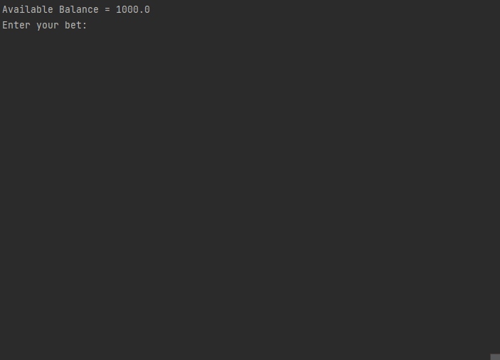

# Blackjack+
Blackjack software that can be played in the console. Classes made for the Deck, Cards, Player and Dealer. Player is able to bet and they have a balance. The game is played with a variable number of decks all of which have been shuffled together. Cards that have been played are discarded from the deck. Return on win is 2to3 or 1.5x if player wins with higher card count and 2to5 or 2.5x for blackjack.

|Blackjack Round Example|
|:---------------------:|
||
